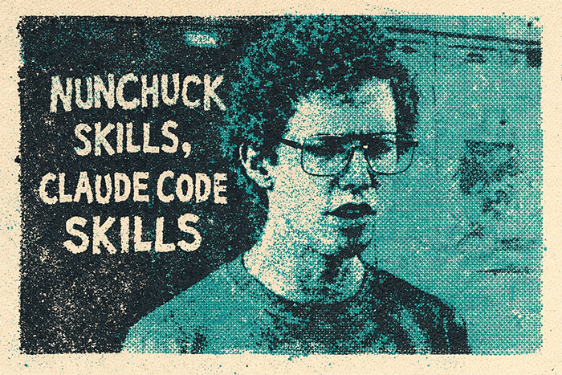

# Nunchuck Skills



> "You know, like nunchuck skills, bow hunting skills, claude code skills. Girls only want boyfriends who have great skills."

A practical engineering playbook for Claude Code. We spent like three hours on the shading the upper lip. It's probably the best playbook I've ever done.

## What's in the Tots

```
nunchuck-skills/
├── commands/                        # Slash commands (triggers)
│   ├── plan.md                      # /plan - product think + systems design
│   ├── python-review.md             # /python-review
│   ├── react-review.md              # /react-review
│   ├── rails-review.md              # /rails-review
│   ├── data-review.md               # /data-review - schema + query review
│   ├── security-review.md           # /security-review - deep security audit
│   ├── scout.md                     # /scout - codebase assessment
│   └── audit.md                     # /audit - ship confident cadences
│
├── agents/                          # Agent definitions (the brains)
│   ├── product-thinker.md           # Conversational requirements extraction
│   ├── codebase-assessor.md         # Stack, schema, test, churn analysis
│   ├── python-reviewer.md           # Python/FastAPI/SQLAlchemy review
│   ├── react-typescript-reviewer.md # React/TypeScript/Vike review
│   ├── rails-reviewer.md            # Ruby on Rails 8 review
│   ├── database-reviewer.md         # PostgreSQL schema + query review
│   └── security-reviewer.md         # Deep security audit (app code + Claude config)
│
├── skills/                          # Deep reference (the knowledge base)
│   ├── workflow.md                  # The 5 phases
│   ├── ship-confident.md            # Daily/weekly/monthly audit cadences
│   ├── python-fastapi-patterns/
│   │   └── SKILL.md                 # FastAPI + SQLAlchemy + Pydantic patterns
│   ├── react-typescript-patterns/
│   │   └── SKILL.md                 # React 19 + Vike + TanStack Query patterns
│   ├── rails-patterns/
│   │   └── SKILL.md                 # Rails 8 + Hotwire + Solid Queue patterns
│   └── database-patterns/
│       └── SKILL.md                 # PostgreSQL schema, query, migration patterns
│
├── rules/                           # Always-loaded guardrails
│   ├── anti-patterns.md             # Hard-won lessons from real mistakes
│   ├── ux-patterns.md               # Scroll architecture, touch targets, mobile layout
│   └── git-workflow.md              # Commits, branches, PRs, research before building
│
└── checklists/                      # Pre-commit checklists
    ├── python-fastapi.md
    ├── typescript-react.md
    └── ruby-rails.md
```

## How It Works

Three layers. Like a layered quesadilla but for code review.

1. **Commands** trigger agents via slash commands (`/python-review`, `/plan`, `/scout`)
2. **Agents** run review/analysis with severity-based filtering and structured output
3. **Skills** provide the deep reference patterns agents draw from

Plus **rules** (always-loaded guardrails) and **checklists** (pre-commit gates).

## The 5 Phases

| Phase | How | When |
|------|-----|------|
| **Scout** | `/scout` | First time in a codebase or starting from scratch |
| **Product Think** | `/plan` | Before writing any code for a new feature |
| **Design** | `/plan` then `/data-review` | After product decisions, before implementation |
| **Build** | Code, then `/python-review` `/react-review` `/rails-review` | The actual coding |
| **Audit** | `/audit daily\|weekly\|monthly` | Ongoing codebase health |

Most vibe coders live in Build and wonder why everything breaks. It's like Rex Kwon Do without the training. You think you're tough? Forget about it.

## Install

Hold on, I forgot to put in the crystals.

```bash
# Clone it somewhere on your machine (not inside your project)
git clone https://github.com/jeanpaulsio/nunchuck-skills.git ~/nunchuck-skills

# Option 1: Install to your current project
cd ~/my-project
~/nunchuck-skills/install.sh

# Option 2: Install globally (applies to all projects)
~/nunchuck-skills/install.sh --global
```

The install script copies files into `.claude/` (local) or `~/.claude/` (global). It doesn't add anything to your project's source code.

## Example: Building Uncle Rico's Time Machine Rental App

Here's how it looks in practice. Uncle Rico wants an app where people can rent his time machine by the hour.

**1. `/plan` - think before you build**

```
> /plan
  I want to build a time machine rental app for my uncle's business.
  People book time slots, pay, use the machine, and return it.
  Sometimes they break it.

Claude: Walk me through what happens from the moment someone wants
        to rent the time machine to when they return it.

> Well they'd pick a time slot, pay, show up, use the machine, and
  bring it back. Sometimes they break it.

Claude: When they break it - does Rico charge them for repairs,
        or is there a damage deposit upfront?

> Damage deposit. And he wants to block people who've broken it before.

Claude: Got it. Here's what I'm hearing:

  Nouns: Customer, Booking, TimeSlot, DamageReport
  Relationships:
    - Customer has many Bookings
    - Booking belongs to one TimeSlot
    - Booking has zero or one DamageReport
  Lifecycle:
    - Booking: reserved -> paid -> active -> returned | damaged
  V1 scope: booking + payments + damage tracking
  Deferred: customer banning (v2)

  Ready to design the schema and API contracts?

> yes

Claude designs the tables, foreign keys, status enums, and
API endpoints. Presents it for your confirmation.
```

**2. `/data-review` - check the schema**

```
> /data-review

Claude: [HIGH] Missing index on bookings.customer_id
        PostgreSQL does not auto-index foreign keys.

        [MEDIUM] Consider a partial unique index on
        time_slots(start_time) WHERE available = true

        Verdict: WARNING - fix the FK index before building.

> fix it
```

**3. Build the feature**

```
> alright, build the booking service

Claude writes the migration, model, service layer, API route,
and tests alongside the implementation.
```

**4. `/python-review` - before you commit**

```
> /python-review

Claude: [HIGH] booking_service.py:45 - service calls commit()
        instead of flush(). Breaks transaction atomicity if
        a later operation in the same request fails.

        [MEDIUM] Missing error path test for double-booking
        the same time slot.

        Verdict: WARNING - fix the commit() call.

> fix both of those

Claude fixes the flush issue and adds the error path test.

> /python-review

Claude: No CRITICAL or HIGH issues. Verdict: APPROVE.

> ok commit this and make a PR
```

**5. `/audit` - after a few weeks of shipping**

```
> /audit weekly

Claude: Looked at last 10 PRs. Findings:

  This sprint:
    - Extract date validation (appears in 3 files) - S, high pain
  Next sprint:
    - Split booking_service.py (crossed 400 lines) - M, medium pain
  Track:
    - test_booking_creation hasn't failed in 2 months - S, low pain
```

### The Commands

```
/plan              think before you build
/python-review     review Python/FastAPI code
/react-review      review React/TypeScript code
/rails-review      review Ruby on Rails code
/data-review       review schema and queries
/security-review   deep security audit before launch
/scout             scout a new or unfamiliar codebase
/audit             codebase health check (daily/weekly/monthly)
```

## Stack Support

All three stacks included. Whatever you want, gosh.

- **Python / FastAPI / SQLAlchemy** - patterns, reviewer agent, checklist
- **TypeScript / React / Vike** - patterns, reviewer agent, checklist
- **Ruby on Rails 8** - patterns, reviewer agent, checklist
- **PostgreSQL** - database patterns and reviewer (cross-stack)

## Philosophy

- The person describes their world. The system translates it into engineering decisions.
- Only include things Claude genuinely doesn't know or gets wrong without guidance.
- Only extract patterns when they appear 3+ times.
- Write tests alongside features, not in a separate backfill sprint.
- Your CLAUDE.md is more valuable than any generic skill.

## Credits

Built by [@jeanpaulsio](https://github.com/jeanpaulsio) from real engineering, real mistakes, and real lessons learned.

Inspired by: Sandi Metz (The Wrong Abstraction), Kent C. Dodds (AHA Programming), Dan Abramov (Goodbye Clean Code), Google Engineering Practices.
