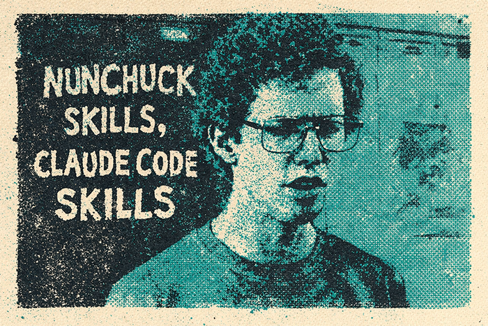

# Nunchuck Skills



> "You know, like nunchuck skills, bow hunting skills, claude code skills. Girls only want boyfriends who have great skills."

A practical code-review playbook for Claude Code. We spent like three hours on the shading the upper lip. It's probably the best playbook I've ever done.

## What's in the Tots

```
nunchuck-skills/
├── commands/                        # Slash commands (triggers)
│   ├── python-review.md             # /python-review
│   ├── react-review.md              # /react-review
│   ├── react-native-review.md       # /react-native-review
│   ├── rails-review.md              # /rails-review
│   ├── data-review.md               # /data-review - schema + query review
│   └── security-review.md           # /security-review - deep security audit
│
├── agents/                          # Reviewer definitions (the brains)
│   ├── python-reviewer.md           # Python/FastAPI/SQLAlchemy review
│   ├── react-typescript-reviewer.md # React/TypeScript/Vike review
│   ├── react-native-reviewer.md     # React Native / Expo review
│   ├── rails-reviewer.md            # Ruby on Rails 8 review
│   ├── database-reviewer.md         # PostgreSQL schema + query review
│   └── security-reviewer.md         # Deep security audit (app code + Claude config)
│
├── skills/                          # Deep reference (the knowledge base)
│   ├── python-fastapi-patterns/
│   │   └── SKILL.md                 # FastAPI + SQLAlchemy + Pydantic patterns
│   ├── react-typescript-patterns/
│   │   └── SKILL.md                 # React 19 + Vike + TanStack Query patterns
│   ├── react-native-expo-patterns/
│   │   └── SKILL.md                 # Expo Router + TanStack Query + EAS patterns
│   ├── rails-patterns/
│   │   └── SKILL.md                 # Rails 8 + Hotwire + Solid Queue patterns
│   └── database-patterns/
│       └── SKILL.md                 # PostgreSQL schema, query, migration patterns
│
├── rules/                           # Always-loaded guardrails
│   ├── anti-patterns.md             # Hard-won lessons from real mistakes
│   ├── ux-patterns.md               # Scroll architecture, touch targets, mobile layout
│   └── git-workflow.md              # Commits, branches, PRs, research before building
│
└── checklists/                      # Pre-commit checklists
    ├── python-fastapi.md
    ├── typescript-react.md
    ├── react-native-expo.md
    └── ruby-rails.md
```

## How It Works

Three layers. Like a layered quesadilla but for code review.

1. **Commands** trigger reviewers via slash commands (`/python-review`, `/data-review`, `/security-review`)
2. **Reviewers** run the review with severity-based filtering and structured output
3. **Skills** provide the deep reference patterns the reviewers draw from

Plus **rules** (always-loaded guardrails) and **checklists** (pre-commit gates).

Each reviewer ranks findings by severity (CRITICAL / HIGH / MEDIUM / LOW), gives a concrete failure scenario for each, and ends with a verdict — `APPROVE` when there's nothing serious, `WARNING` when there is. You decide what to fix. Nothing gets changed automatically.

## Example: Reviewing Uncle Rico's Time Machine Rental App

Here's how it looks in practice. Uncle Rico built an app where people rent his time machine by the hour, and now the booking service needs a review before it ships.

**1. `/data-review` - check the schema first**

```
> /data-review

Claude: [HIGH] Missing index on bookings.customer_id
        PostgreSQL does not auto-index foreign keys. Every
        "show me this customer's bookings" query does a full
        table scan.

        [MEDIUM] Consider a partial unique index on
        time_slots(start_time) WHERE available = true

        Verdict: WARNING - fix the FK index before building on this.

> fix it
```

**2. `/python-review` - before you commit the service**

```
> /python-review

Claude: [HIGH] booking_service.py:45 - service calls commit()
        instead of flush(). Breaks transaction atomicity if
        a later operation in the same request fails.

        [MEDIUM] Missing error path test for double-booking
        the same time slot.

        Verdict: WARNING - fix the commit() call.

> fix both of those

Claude fixes the flush issue and adds the error path test.

> /python-review

Claude: No CRITICAL or HIGH issues. Verdict: APPROVE.

> ok commit this and make a PR
```

**3. `/security-review` - before you launch**

```
> /security-review

Claude: [CRITICAL] Damage-deposit amount is trusted from the
        client request body. A customer can set their own
        deposit to $0.

        [MEDIUM] Booking IDs are sequential integers -- trivial
        to enumerate other customers' bookings.

        Verdict: WARNING - do not launch until the deposit
        amount is server-computed.
```

Most vibe coders skip the review and wonder why everything breaks in production. It's like Rex Kwon Do without the training. You think you're tough? Forget about it.

## The Commands

```
/python-review         review Python/FastAPI code
/react-review          review React/TypeScript code
/react-native-review   review React Native / Expo code
/rails-review          review Ruby on Rails code
/data-review           review schema and queries
/security-review       deep security audit before launch
```

## Stack Support

All four stacks included. Whatever you want, gosh.

- **Python / FastAPI / SQLAlchemy** - patterns, reviewer, checklist
- **TypeScript / React / Vike** - patterns, reviewer, checklist
- **React Native / Expo** - patterns, reviewer, checklist
- **Ruby on Rails 8** - patterns, reviewer, checklist
- **PostgreSQL** - database patterns and reviewer (cross-stack)

## Install

Hold on, I forgot to put in the crystals.

```bash
# Clone it somewhere on your machine (not inside your project)
git clone https://github.com/jeanpaulsio/nunchuck-skills.git ~/nunchuck-skills

# Option 1: Install to your current project
cd ~/my-project
~/nunchuck-skills/install.sh

# Option 2: Install globally (applies to all projects)
~/nunchuck-skills/install.sh --global
```

The install script copies files into `.claude/` (local) or `~/.claude/` (global). It doesn't add anything to your project's source code.

## Philosophy

- A reviewer is a second pair of eyes, not a safety net for a sloppy first pass. When it catches the same category of issue every time, catch it during implementation instead.
- Only include things Claude genuinely doesn't know or gets wrong without guidance.
- Only extract patterns when they appear 3+ times.
- Rank findings by severity and give a real failure scenario. A finding you can't turn into a repro isn't worth surfacing.
- Your CLAUDE.md is more valuable than any generic skill.

## Credits

Built by [@jeanpaulsio](https://github.com/jeanpaulsio) from real engineering, real mistakes, and real lessons learned.

Inspired by: Sandi Metz (The Wrong Abstraction), Kent C. Dodds (AHA Programming), Dan Abramov (Goodbye Clean Code), Google Engineering Practices.
